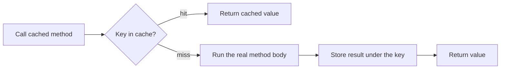
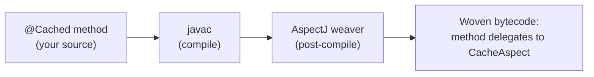

<div align="center">

# ☕ Cacheasy

**Annotation-based method caching for Java — one annotation, zero boilerplate, pluggable backends.**

[](https://openjdk.org/projects/jdk/17/)
[](https://gradle.org/)
[](https://eclipse.dev/aspectj/)
[](#-license)

</div>

---

Add `@Cached` to a method and its results are cached automatically. No proxies to wire up, no
cache lookups to write, no changes at the call site — the caching is **woven into your bytecode at
build time**.

```java
@Cached(cacheProvider = ConcurrentHashMap.class, expiresAfter = 30)
public Report buildReport(String accountId) {
    return crunchExpensiveNumbers(accountId); // runs once per accountId per 30s
}
```

That's the whole API. Call `buildReport("acme")` ten times in a row and the body runs **once**.

---

## Table of contents

- [Why Cacheasy](#-why-cacheasy)
- [How it works](#-how-it-works)
- [Install & set up](#-install--set-up)
- [Quick start](#-quick-start)
- [Supported backends](#-supported-backends)
- [Configuration](#-configuration)
- [What the build actually does](#-what-the-build-actually-does)
- [Project layout](#-project-layout)
- [Build, run & test](#-build-run--test)
- [Design notes](#-design-notes)
- [Limitations](#-limitations)
- [License](#-license)

---

## ✨ Why Cacheasy

- **One annotation.** `@Cached` and you're done — no boilerplate, no DI container required.
- **Transparent.** Caching is woven into the compiled class, so callers use your methods exactly
  as before. Nothing leaks into your API.
- **Pluggable backends.** Caffeine, Guava, Ehcache, Redis, or a dependency-free
  `ConcurrentHashMap` — chosen per method, auto-detected from your classpath.
- **No runtime reflection on the hot path.** The work happens at build time; at runtime it's a
  plain method call into the advice.
- **Flexible expiry.** Time-to-live or time-to-idle, in any `TimeUnit`.

---

## 🧠 How it works

At **runtime**, every call to a `@Cached` method flows through a single piece of advice:



The key is derived from the method and its arguments (`com.acme.Service#buildReport;<argHash>`), and
the value is stored in whichever backend you named in the annotation.

The magic is *where* that advice comes from — see [What the build actually does](#-what-the-build-actually-does).

---

## 📦 Install & set up

Cacheasy uses **AspectJ compile-time weaving**, so a consuming project applies a weaving plugin and
puts Cacheasy on the `aspect` path. Here's a complete `build.gradle`:

```groovy
plugins {
    id 'java'
    // Weaves Cacheasy's aspect into your @Cached methods at build time.
    id 'io.freefair.aspectj.post-compile-weaving' version '9.5.0'
}

repositories { mavenCentral() }

dependencies {
    implementation 'com.joeyexecutive:cacheasy:1.0-SNAPSHOT'
    aspect         'com.joeyexecutive:cacheasy:1.0-SNAPSHOT'  // <- enables weaving against the aspect
    implementation 'org.aspectj:aspectjrt:1.9.25'             // <- AspectJ runtime

    // Optional: a cache backend. Omit this to use the zero-dependency ConcurrentHashMap default.
    implementation 'com.github.ben-manes.caffeine:caffeine:3.0.0'
}
```

> **Heads up:** the two lines that make weaving work are the **plugin** and the **`aspect`**
> dependency. Without them, `@Cached` compiles fine but does nothing.

<details>
<summary>Using it from within this repository (the <code>example/</code> module)</summary>

The bundled example consumes the library as a Gradle project dependency instead of a published
artifact:

```groovy
dependencies {
    implementation project(':')
    aspect         project(':')
    implementation 'org.aspectj:aspectjrt:1.9.25'
    implementation 'com.github.ben-manes.caffeine:caffeine:3.0.0'
}
```
</details>

---

## 🚀 Quick start

**1. Annotate a method.** Pick a backend via `cacheProvider` and set an expiry.

```java
import com.joeyexecutive.cacheasy.annotation.Cached;
import java.util.concurrent.ConcurrentHashMap;
import java.util.concurrent.TimeUnit;

public class GreetingService {

    @Cached(cacheProvider = ConcurrentHashMap.class, expiresAfter = 5, expiresTimeUnit = TimeUnit.MINUTES)
    public String expensiveGreeting(String name) {
        System.out.println("computing for " + name); // prints once per name
        return "Hello, " + name + "!";
    }
}
```

**2. Call it like any other method.**

```java
GreetingService service = new GreetingService();
service.expensiveGreeting("Alice"); // prints "computing for Alice", returns greeting
service.expensiveGreeting("Alice"); // cache hit — no print, same value
service.expensiveGreeting("Bob");   // prints "computing for Bob" (different key)
```

That's it. No factory, no proxy, no cache object to manage.

---

## 🔌 Supported backends

The backend is selected per method by the class you pass to `cacheProvider`. The built-in providers
**self-register when their library is on the classpath** — so you only ship the one you use.

| Backend | `cacheProvider = ...` | Dependency | Notes |
|---|---|---|---|
| **ConcurrentHashMap** | `ConcurrentHashMap.class` | _none (JDK)_ | Zero-dependency default. Timestamp-based TTL, lazy eviction. |
| **Caffeine** | `com.github.benmanes.caffeine.cache.Cache.class` | `com.github.ben-manes.caffeine:caffeine` | High-performance local cache. |
| **Guava** | `com.google.common.cache.Cache.class` | `com.google.guava:guava` | Classic local cache. |
| **Ehcache 3** | `org.ehcache.Cache.class` | `org.ehcache:ehcache` | On-heap; write→TTL, access→TTI. |
| **Redis** | `redis.clients.jedis.Jedis.class` | `redis.clients:jedis` | Distributed/shared. Values must be `Serializable`. Defaults to `localhost:6379`. |

**Need a custom backend or a configured one?** Implement `AbstractCacheProvider<C>` and register it:

```java
// e.g. point the Redis backend at a real server
Cacheasy.registerCacheProvider(
        redis.clients.jedis.Jedis.class,
        new RedisCacheProvider("cache.internal", 6379));
```

---

## ⚙️ Configuration

All knobs live on the `@Cached` annotation:

| Attribute | Type | Default | Description |
|---|---|---|---|
| `cacheProvider` | `Class<?>` | _(required)_ | The backend type — see the table above. |
| `expiresAfter` | `long` | _(required)_ | Entry lifetime, in `expiresTimeUnit`. |
| `expiresTimeUnit` | `TimeUnit` | `SECONDS` | Unit for `expiresAfter`. |
| `expiryType` | `CacheExpiryType` | `EXPIRES_AFTER_WRITE` | `EXPIRES_AFTER_WRITE` (time-to-live) or `EXPIRES_AFTER_ACCESS` (time-to-idle). |

```java
@Cached(
    cacheProvider   = org.ehcache.Cache.class,
    expiresAfter    = 10,
    expiresTimeUnit = TimeUnit.MINUTES,
    expiryType      = CacheExpiryType.EXPIRES_AFTER_ACCESS
)
public List<Order> recentOrders(String userId) { ... }
```

---

## 🛠 What the build actually does

This is the interesting part. Cacheasy never modifies your source files — instead, the **AspectJ
weaver rewrites the compiled `.class`** after `javac` runs:



Concretely, the weaver moves your original method body into a generated helper and replaces the
method with a call into the caching advice. Decompile a woven class and you'll see it:

```text
// BEFORE weaving — your code
public String expensiveGreeting(String name) {
    return "Hello, " + name + "!";
}

// AFTER weaving — what actually ships (javap, simplified)
public String expensiveGreeting(String name) {
    CacheAspect.aspectOf().aroundCached(/* join point */, /* @Cached */);   // <- caching wrapper
}
static String expensiveGreeting_aroundBody0(GreetingService, String) {     // <- your original body
    return "Hello, " + name + "!";
}
```

At runtime, [`CacheAspect.aroundCached`](src/main/java/com/joeyexecutive/cacheasy/aspect/CacheAspect.java)
resolves the provider from the [`Cacheasy`](src/main/java/com/joeyexecutive/cacheasy/Cacheasy.java)
registry, builds the key, and either returns a cached value or runs `expensiveGreeting_aroundBody0`
once and stores it.

---

## 🗂 Project layout

```
cacheasy/
├── src/main/java/com/joeyexecutive/cacheasy/
│   ├── annotation/
│   │   ├── Cached.java              # the @Cached annotation (public API)
│   │   └── CacheExpiryType.java     # time-to-live vs time-to-idle
│   ├── aspect/
│   │   └── CacheAspect.java         # the woven around-advice (the engine)
│   ├── provider/
│   │   ├── AbstractCacheProvider.java   # backend SPI
│   │   ├── ConcurrentMapCacheProvider.java
│   │   ├── CaffeineCacheProvider.java
│   │   ├── GuavaCacheProvider.java
│   │   ├── EhcacheCacheProvider.java
│   │   └── RedisCacheProvider.java
│   └── Cacheasy.java                # backend registry (classpath auto-detection)
└── example/                         # a runnable consumer module — see it in action
    └── src/main/java/com/example/app/{GreetingService,Main}.java
```

---

## ▶️ Build, run & test

This is a multi-module Gradle build (library + `example`). Use the wrapper — no local Gradle needed.

```bash
# Build everything and run all tests
./gradlew build

# Run the example app (watch the cache hit/miss output)
./gradlew :example:run

# Inspect the woven bytecode of the example's @Cached method
javap -c -p -classpath example/build/classes/java/main com.example.app.GreetingService
```

Tests cover the cache contract across every in-process backend (put/get/remove/clear, exact size,
TTL expiry) plus an end-to-end weaving check in the `example` module.

> Requires a JDK 17 toolchain (auto-selected by Gradle). Redis isn't unit-tested here since it
> needs a live server; it's compile-checked.

---

## 💡 Design notes

A few deliberate engineering choices worth calling out:

- **Compile-time weaving over runtime proxies.** Spring-style proxies need a container and can't
  cache calls a class makes to *itself*. Weaving rewrites the method in place, so self-invocation
  and plain `new` both work — at the cost of a build-time step.
- **Classpath auto-detection via reflective registration.** The registry instantiates each built-in
  provider *by name* and only after confirming its backend class loads. That keeps `Cacheasy`
  loadable even when you've pulled in just one backend — referencing the provider classes directly
  would drag every backend onto your classpath.
- **One small SPI.** Adding a backend means implementing six methods on `AbstractCacheProvider`;
  the annotation, registry, and aspect stay untouched.

---

## ⚠️ Limitations

- Keys use **argument hash codes**, so a hash collision could (in theory) return the wrong cached
  value. Fine for typical inputs; not for adversarial ones.
- **`null` returns are not cached** — they recompute each call (most backends reject `null` values).
- The **Redis** backend serializes values with Java serialization, so cached return types must be
  `Serializable`.
- A consuming build **must** apply the AspectJ weaving plugin; without it, `@Cached` is inert.

---

## 📄 License

Released under the **MIT License**.

---

<div align="center">
<sub>Built as a portfolio project to explore compile-time weaving and clean, pluggable API design.</sub>
</div>
